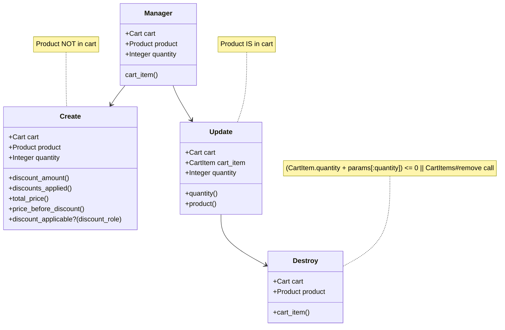
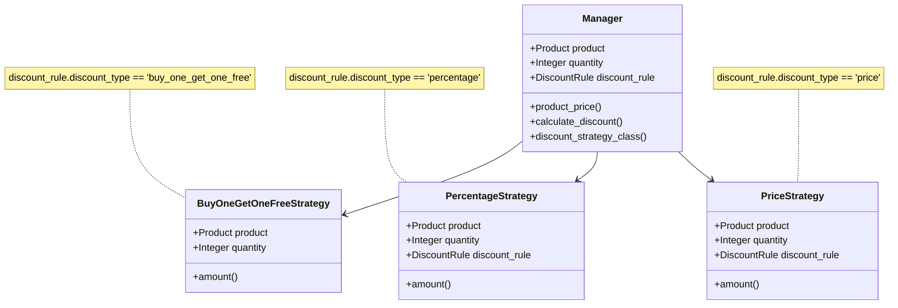

# Shopping cart app

An app that allows you to add products, define discount rules for each product, and put them into the cart!

## Table of contents
* [DEV environment](#setting-up-the-environment)
* [Database](#database)
* [Logic](#a-few-words-about-logic)

## Setting up the environment
1. Get Ruby `3.3.3`
2. `bundle install`
3. `rails db:create && rails db:migrate && rails db:seed`

Nothing else is needed. Bootstrap is already in the project files.

## Database

I went for UUID as cart ID for security reasons.
Almost all the validation is on the DB level (in models too) to assure only valid data is saved into DB no matter what.
We don't want `nil` prices or amounts.

## A few words about logic

Each product can have zero or more discount rules. `Cart` holds `CartItems`, and each `Product` group is a `CartItem`.

`DiscountRule` attributes
- `discount_type` - type of discount based on which we calculate the product group price.
- `amount` - amount of discount in cash/percent, depending on `type`. Always greater than `0`.
- `min_quantity` - minimum product quantity from which the discount is applied. Greater than or equal to `0` (we may want to discount the product regardless of its amount)
- `status` - status of the rule `active | inactive`. Each product can have exactly `1` active pricing rule.

There are 3 `type`s to choose from for the `DiscountRule`:
- `buy_one_get_one_free` - every other product is free of charge. `min_quantity` and `amount` are not taken into account during the calculation
- `price` - price discount on every product
- `percentage` - percentage discount on every product

Prices and percentage have to be passed as integers: 5% ➡️ 50, 10€ ➡️ 100. They're displayed that way in forms, but the user sees the normal user-friendly price format, e.g €3.11.

___

We have 2 methods to manage the `Cart`

- `add` - to add items and change their quantity. We can increase or decrease the amount by `Quantity` input. `ShoppingCart::Items::Manager` is called here.
The amount increases when we pass positive value and decreases otherwise.
- `remove` - to remove particular item completely. `ShoppingCart::Items::Destroy` is called.

To manage `CartItems`

- `Manager` - called when we add an item to the cart. If the item is already in cart, it tries to update it. Otherwise - creates a new one.
- `Create` - as the name says - creates a new `CartItem` and calculates its discount (if any applicable).
- `Update` - if the current `CartItem.quantity + :quantity` param from the input is positive - updates the value. If it's negative - call `Destroy` class.
- `Destroy` - destroys the `CartItem`. No additional logic here.

Each discount rule has a separate strategy that does the calculation. I've used `#ceil` for rounding, because it's rounding up (in customer favor), while `#round` is rounding down 😄

`DiscountCalculator::Manager` is responsible for delegating to the right strategy based on `PricingRule.discount_type`. It's called in `ShoppingCart::Items::Create#discount_amount` and `ShoppingCart::Items::Update#discount_amount`.

